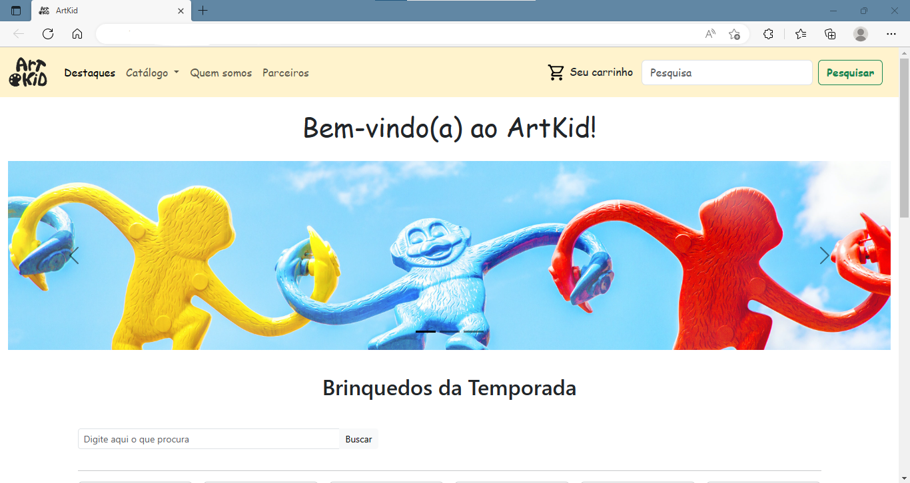
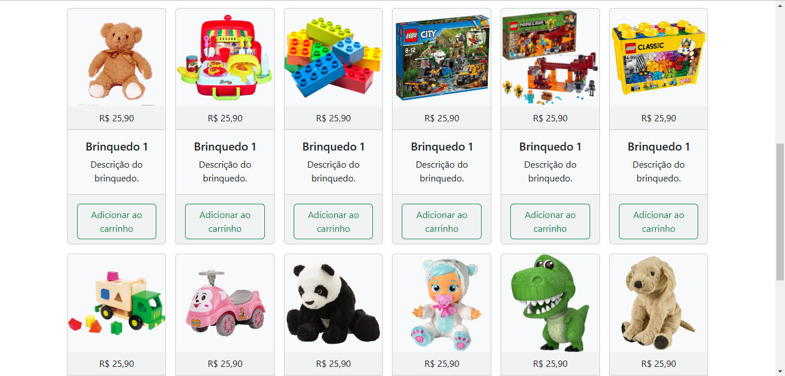
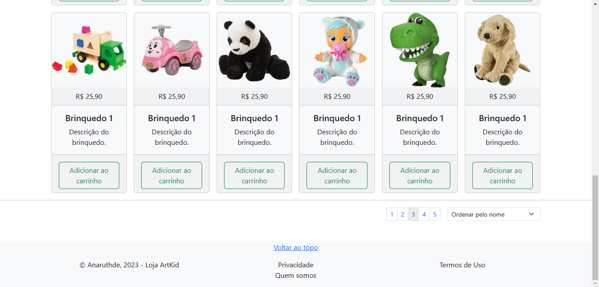

## Info

<h1 align="center"> Loja ArtKid </h1>

A ideia deste projeto é construir um site para uma loja virtual, onde todo o processo de programação é feita com base nas aulas do curso Web Design - CVTI

 

## Tecnologias usadas

- HTML e CSS
- Git e Github
- Figma

## Layout

O Design do logo é uma produção autoral, utilizando o Figma como ferramenta de auxílio.
O layout do Readme é baseado na interface do evento Rocketseat (link)

<b><b>

<h1 align="center"> Abaixo preview da interface do site </h1>

    
    
    

